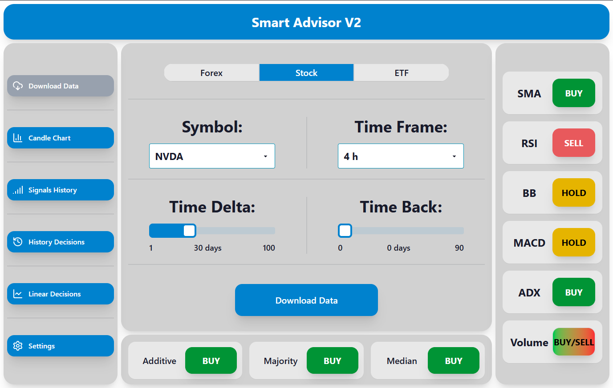
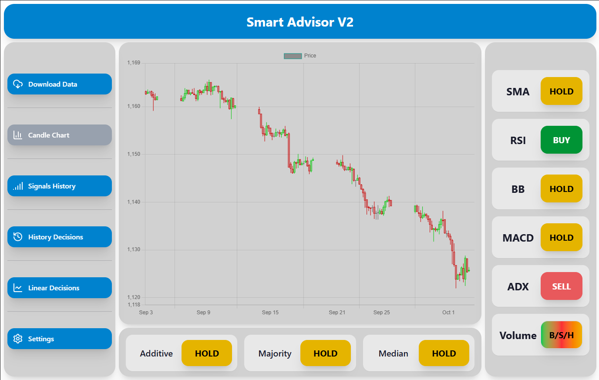
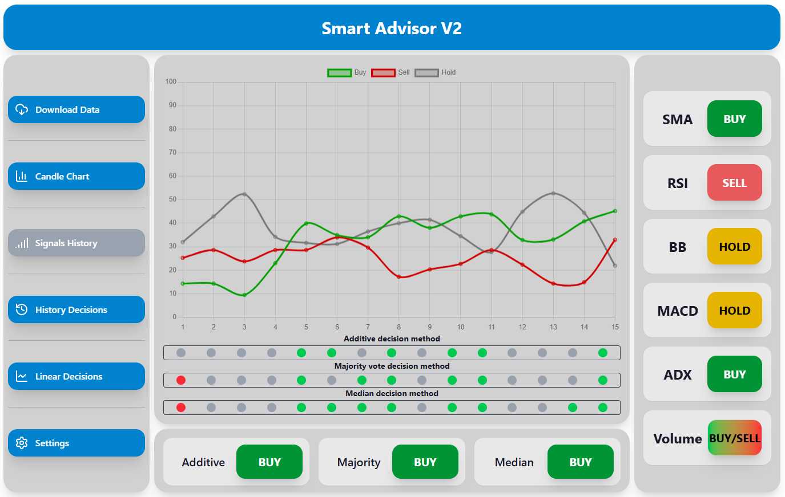
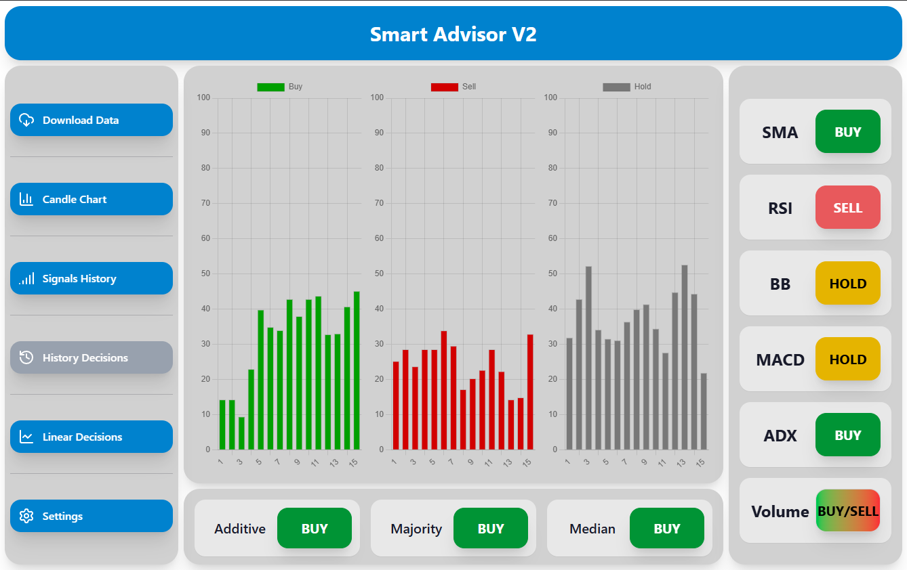
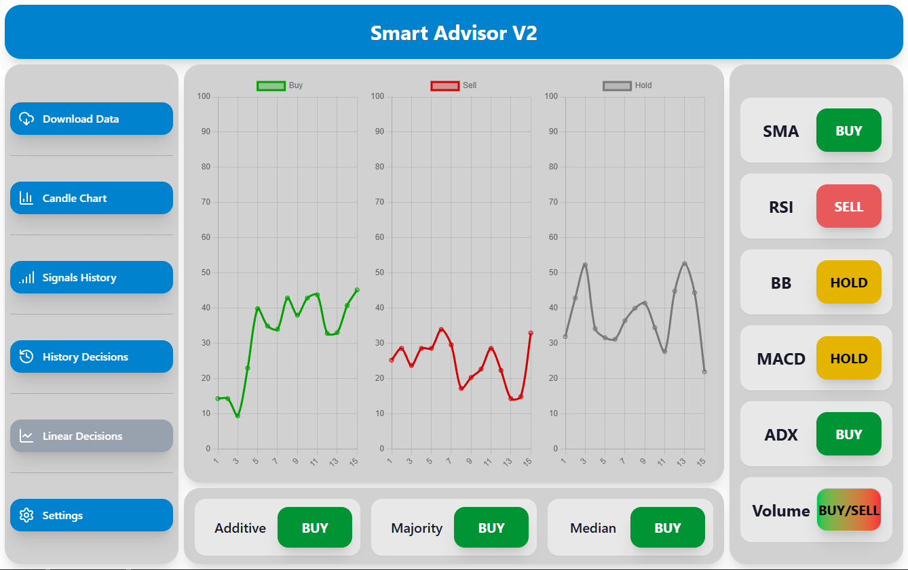
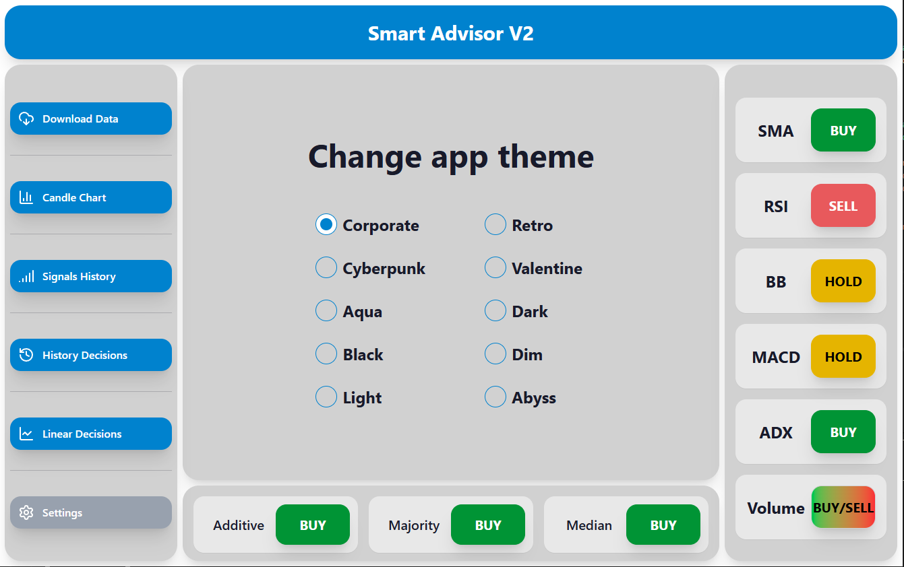
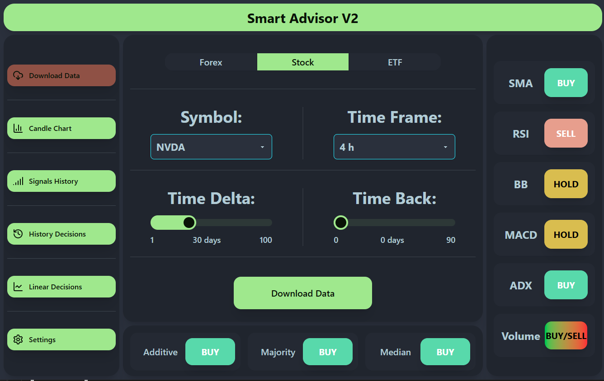
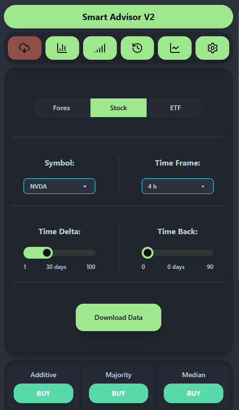
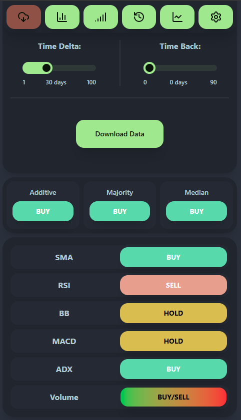
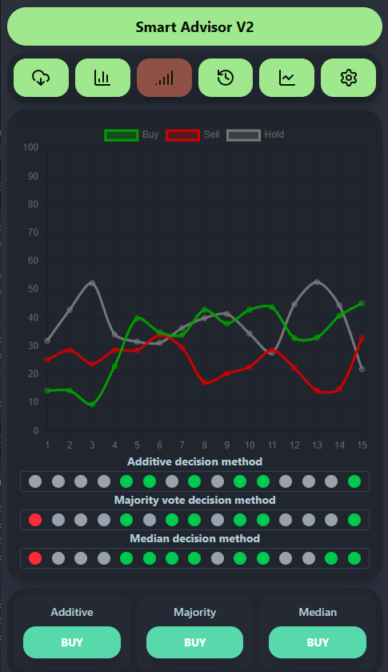

# Smart Advisor V2

## Table of Content

- [Used Technologies](#used-technologies)
- [Developer Guide](#developer-guide)
- [Application Apperance](#application-apperance)

## Used Technologies

- Python 3.13
- FastAPI
- React
- Tailwind CSS
- Daisy UI
- TypeScript

## Developer Guide

1. Install NodeJs.
2. Install Docker or Podman witch compose extension.
3. Enter `./frontend` directory and run the following command:

```bash
npm ci
```

4. Back to the main application direcory and run the following command:

```bash
npm run initialize
```

5. If you want to run frontend of appliaction execute the following command:

```bash
npm run dev-frontend
```

6. If you want to run backend of application execute the following command:

```bash
npm run dev-backend
```

7. If you want to rebuild all application files use local CICD by executing the command below:

```bash
npm run cicd
```

8. If you want to run compose file execute command below:

```bash
podman/docker compose up
```

### Tip

- For more usefull commands you can check `package.json` file.

## Application Apperance

- Main application window containing the window for downloading historical stock market data:



- Main application window showing an interactive candlestick chart created based on previously downloaded data:



- Main application window showing signals transmitted by applications in the past:



- Main application window showing the percentage values of the signal strength transmitted by all expert systems:



- The same data shown in a line graph:



- Application theme settings:



- Download data window in "Dim" theme:



- Download data window in "Dim" theme, mobile version 1/2:

<p align="center">
  
</p>

- Download data window in "Dim" theme, mobile version 2/2:

<p align="center">
  
</p>

- Signals history page in "Dim" theme on mobile:

<p align="center">
  
</p>
